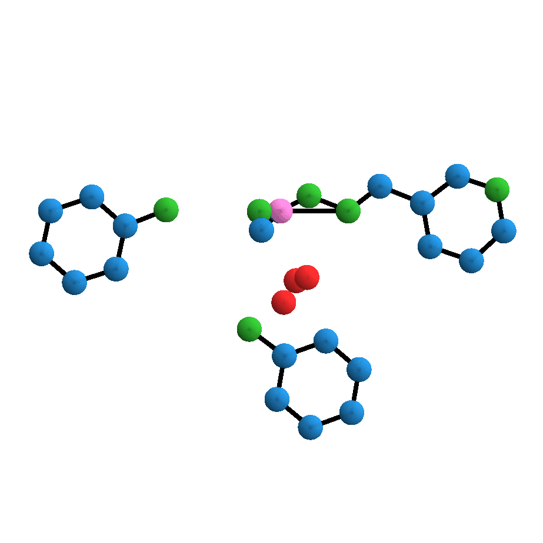
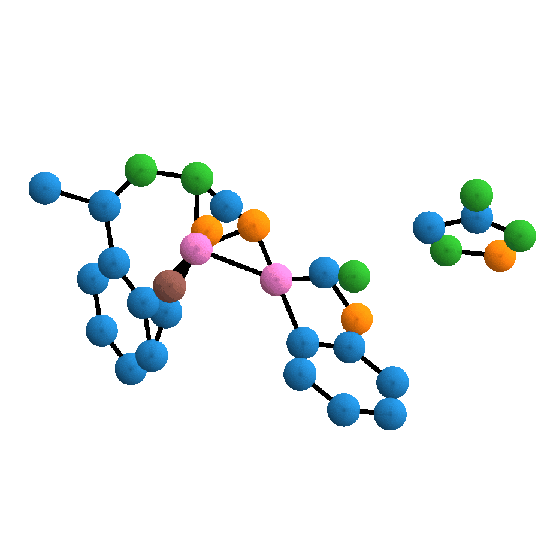
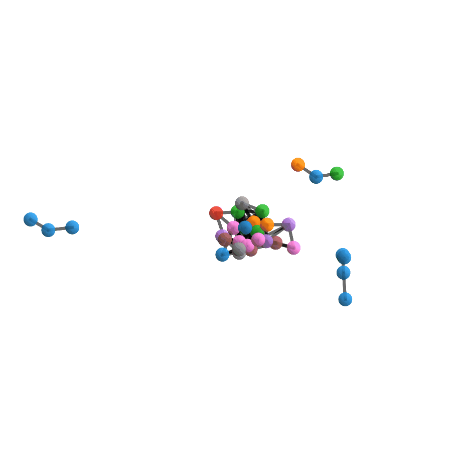
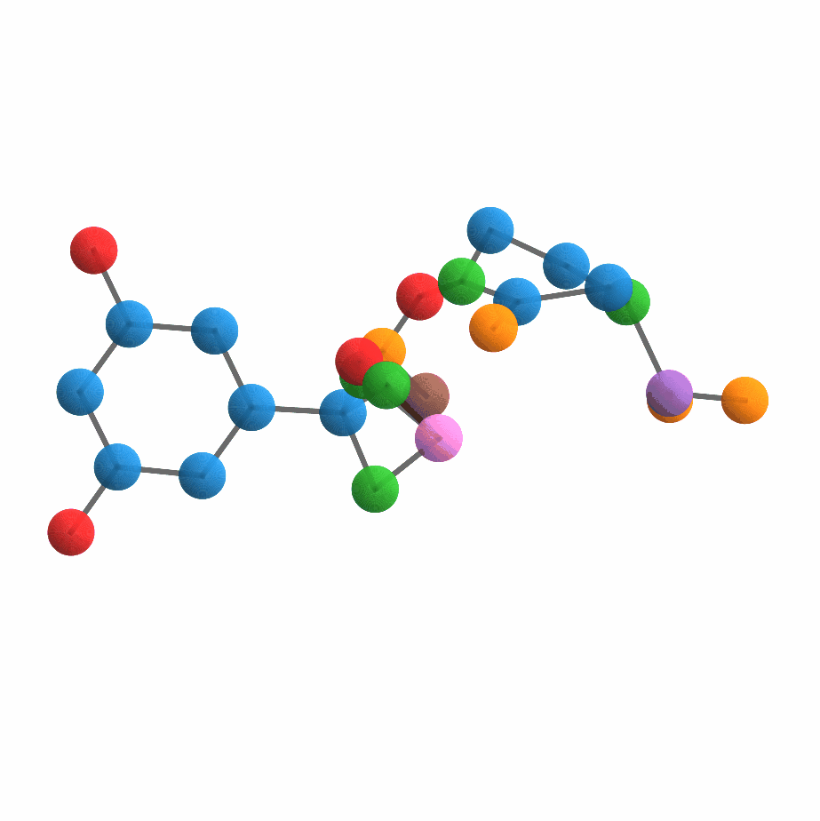
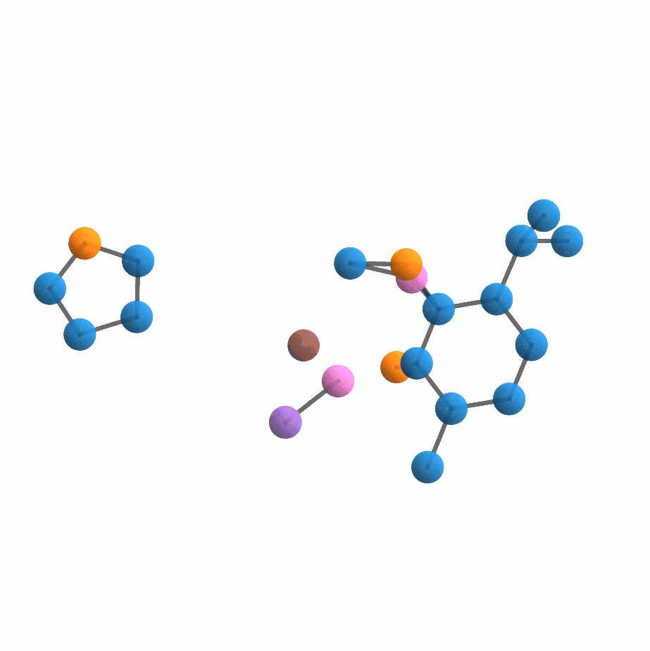
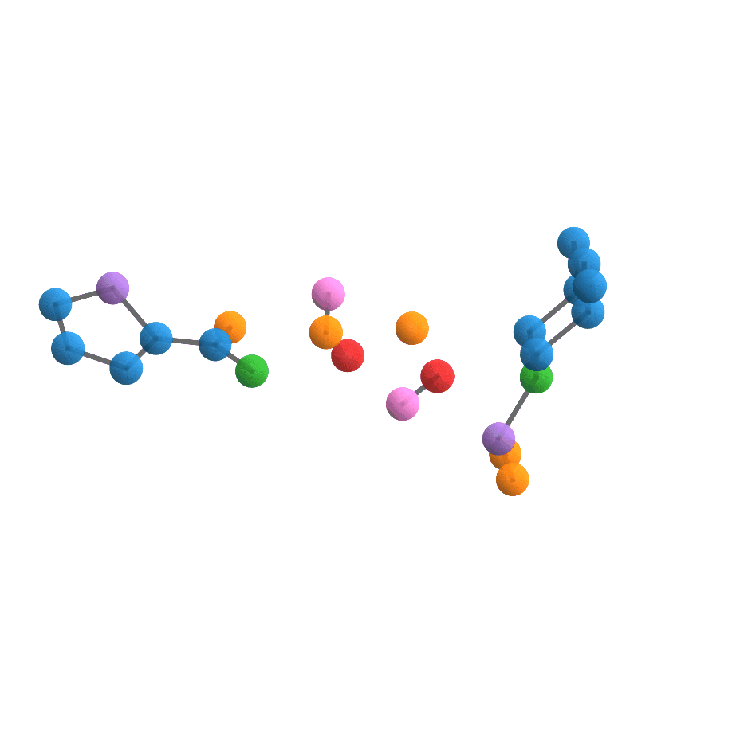
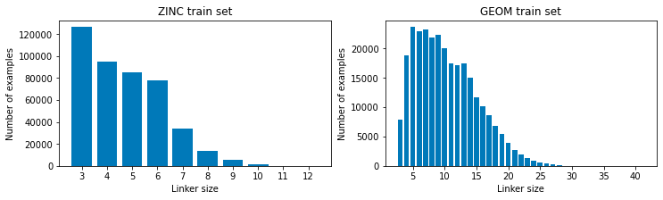

# DiffLinker: Equivariant 3D-Conditional Diffusion Model for Molecular Linker Design

[](https://huggingface.co/spaces/igashov/DiffLinker) [](https://zenodo.org/doi/10.5281/zenodo.10515726)


Official implementation of DiffLinker, an [**Equivariant 3D-conditional Diffusion Model for Molecular Linker Design**](https://www.nature.com/articles/s42256-024-00815-9) by Ilia Igashov, Hannes Stärk, Clément Vignac, Arne Schneuing, Victor Garcia Satorras, Pascal Frossard, Max Welling, Michael Bronstein and Bruno Correia.

>Given a set of disconnected fragments in 3D, DiffLinker places missing atoms in between and designs a molecule incorporating all the initial fragments. 
Our method can link an arbitrary number of fragments, requires no information on the attachment atoms and linker size, and can be conditioned on the protein pockets.


<details>
<summary>Animations</summary>
<br>

<p float="left">
  
  
  
</p>

<p float="left">
  
  
  
</p>

</details>

## Environment Setup

The code was tested in the following environment:

| Software          | Version   |
|-------------------|-----------|
| Python            | 3.10.5    |
| CUDA              | 10.2.89   |
| PyTorch           | 1.11.0    |
| PyTorch Lightning | 1.6.3     |
| OpenBabel         | 3.0.0     |

You can create a new conda environment using provided `environment.yaml` file:
```shell
conda env create -f environment.yml
```

or manually creating the base environment:
```shell
conda create -c conda-forge -n difflinker rdkit
```

and installing all the necessary packages:
```shell
biopython
imageio
networkx
pytorch
pytorch-lightning
scipy
scikit-learn
tqdm
wandb
```

Activate the environment:
```shell
conda activate difflinker
```

Normally, the whole installation process takes 5-10 min.

## Models

Please find the models [here](https://zenodo.org/records/10988017) or use direct download links:
* [[ZINC] DiffLinker](https://zenodo.org/record/7121300/files/zinc_difflinker.ckpt?download=1)                 
* [[ZINC] DiffLinker (given anchors)](https://zenodo.org/record/7121300/files/zinc_difflinker_given_anchors.ckpt?download=1)   
* [[ZINC] Size GNN](https://zenodo.org/record/7121300/files/zinc_size_gnn.ckpt?download=1)                   
* [[GEOM] DiffLinker](https://zenodo.org/record/7121300/files/geom_difflinker.ckpt?download=1)                 
* [[GEOM] DiffLinker (given anchors)](https://zenodo.org/record/7121300/files/geom_difflinker_given_anchors.ckpt?download=1)   
* [[GEOM] Size GNN](https://zenodo.org/record/7121300/files/geom_size_gnn.ckpt?download=1)                   
* [[Pockets] DiffLinker (full pocket)](https://zenodo.org/records/10988017/files/pockets_difflinker_full_no_anchors_fc_pdb_excluded.ckpt?download=1)
* [[Pockets] DiffLinker (full pocket, given anchors)](https://zenodo.org/records/10988017/files/pockets_difflinker_full_fc_pdb_excluded.ckpt?download=1)         
* [[Pockets] DiffLinker (backbone atoms, given anchors)](https://zenodo.org/record/7121300/files/pockets_difflinker_backbone.ckpt?download=1)     
* [[Pockets] DiffLinker (unconditioned, given anchors)](https://zenodo.org/record/7121300/files/pockets_difflinker_unconditioned.ckpt?download=1)

## Usage

### Generating linkers for your own fragments

#### 1. Without protein pocket

First, download necessary models and create directories (we recommend to use GEOM models as they are the most generic):
```shell
mkdir -p models
wget https://zenodo.org/record/7121300/files/geom_difflinker.ckpt?download=1 -O models/geom_difflinker.ckpt
wget https://zenodo.org/record/7121300/files/geom_size_gnn.ckpt?download=1 -O models/geom_size_gnn.ckpt
```

Generate linkers for your own fragments:
```shell
python -W ignore  generate.py --fragments <YOUR_PATH> --model models/geom_difflinker.ckpt --linker_size models/geom_size_gnn.ckpt
```

#### 2. With protein pocket (full atomic representation)

If you have the full target protein and want the pocket to be computed automatically based on the input fragments:
```shell
mkdir -p models
wget https://zenodo.org/records/10988017/files/pockets_difflinker_full_no_anchors_fc_pdb_excluded.ckpt?download=1 -O models/pockets_difflinker_full.ckpt
python -W ignore generate_with_protein.py --fragments <FRAGMENTS_PATH> --protein <PROTEIN_PATH> --model models/pockets_difflinker_full.ckpt --linker_size <DESIRED_LINKER_SIZE> --anchors <COMMA_SEPARATED_ANCHOR_INDICES> 
```

If you want to use the file with pocket you computed yourself:
```shell
mkdir -p models
wget https://zenodo.org/records/10988017/files/pockets_difflinker_full_no_anchors_fc_pdb_excluded.ckpt?download=1 -O models/pockets_difflinker_full.ckpt
python -W ignore generate_with_pocket.py --fragments <FRAGMENTS_PATH> --pocket <POCKET_PATH> --model models/pockets_difflinker_full.ckpt --linker_size <DESIRED_LINKER_SIZE> --anchors <COMMA_SEPARATED_ANCHOR_INDICES> 
```

#### 3. With protein pocket (backbone representation)

```shell
mkdir -p models
wget https://zenodo.org/record/7121300/files/pockets_difflinker_backbone.ckpt?download=1 -O models/pockets_difflinker_backbone.ckpt
python -W ignore generate_with_pocket.py --fragments <FRAGMENTS_PATH> --pocket <POCKET_PATH> --backbone_atoms_only --model models/pockets_difflinker_backbone.ckpt --linker_size <DESIRED_LINKER_SIZE> --anchors <COMMA_SEPARATED_ANCHOR_INDICES>
```

#### Note:
- Fragment file should be passed in one of the following formats: `.sdf`, `.pdb`, `.mol`, `.mol2`
- Protein should be passed in `.pdb` format
- Currently pocket-conditioned generation does not support prediction and sampling of the linker size (will be added later)
- To obtain correct anchor indices for your fragments, you can open the file in PyMOL and click `Label -> atom identifiers -> ID`. You can select anchor atoms and pass the corresponding IDs to the generation script
- For more options check help: `python generate.py --help` or `python generate_with_pocket.py --help`

### Training DiffLinker

First, download datasets:
```shell
mkdir -p datasets
wget https://zenodo.org/record/7121271/files/zinc_final_train.pt?download=1 -O datasets/zinc_final_train.pt
wget https://zenodo.org/record/7121271/files/zinc_final_val.pt?download=1 -O datasets/zinc_final_val.pt
```

Next, create necessary directories:
```shell
mkdir -p models
mkdir -p logs
```

Run trainig:
```shell
python -W ignore train_difflinker.py --config configs/zinc_difflinker.yml
```

### Training Size GNN

In this example, we will consider the training and testing process on the ZINC dataset. 
All the instructions about downloading or creating datasets from scratch can be found in `data` directory.

```shell
python -W ignore train_size_gnn.py \
                 --experiment zinc_size_gnn \
                 --data datasets \
                 --train_data_prefix zinc_final_val \
                 --val_data_prefix zinc_final_val \
                 --hidden_nf 256 \
                 --n_layers 5 \
                 --batch_size 256 \
                 --normalization batch_norm \
                 --lr 1e-3 \
                 --task classification \
                 --loss_weights \
                 --device gpu \
                 --checkpoints models \
                 --logs logs
```

There are the distributions of numbers of atoms in linkers used for training linker size prediction GNNs:



### Sampling

First, download test dataset:
```shell
mkdir -p datasets
wget https://zenodo.org/record/7121271/files/zinc_final_test.pt?download=1 -O datasets/zinc_final_test.pt
```

Download the necessary models:
```shell
mkdir -p models
wget https://zenodo.org/record/7121300/files/zinc_difflinker.ckpt?download=1 -O models/zinc_difflinker.ckpt
wget https://zenodo.org/record/7121300/files/zinc_size_gnn.ckpt?download=1 -O models/zinc_size_gnn.ckpt
```

Next, create necessary directories:
```shell
mkdir -p samples
mkdir -p trajectories
```

If you want to sample 250 linkers for each input set of fragments, run the following:
```shell
python -W ignore sample.py \
                 --checkpoint models/zinc_difflinker.ckpt \
                 --linker_size_model models/zinc_size_gnn.ckpt \
                 --samples samples \
                 --data datasets \
                 --prefix zinc_final_test \
                 --n_samples 2 \
                 --device cuda:0
```
You will be able to see `.xyz` files of the generated molecules in the directory `./samples`.

If you want to sample linkers and save trajectories, run the following:
```shell
python -W ignore sample_trajectories.py \
                 --checkpoint models/zinc_difflinker.ckpt \
                 --chains trajectories \
                 --data datasets \
                 --prefix zinc_final_test \
                 --keep_frames 10 \
                 --device cuda:0
```
You will be able to see trajectories as `.xyz`, `.png` and `.gif` files in the directory `./trajectories`. 

### Evaluation

First, you need to download ground-truth SMILES and SDF files of molecules, 
fragments and linkers from the relevant test sets (recomputed with OpenBabel) + SMILES of the training linkers.
Check [this resource](https://doi.org/10.5281/zenodo.7121448) for finding the right ones.
Here, we will download files for ZINC:
```shell
mkdir -p datasets
wget https://zenodo.org/record/7121448/files/zinc_final_test_smiles.smi?download=1 -O datasets/zinc_final_test_smiles.smi
wget https://zenodo.org/record/7121448/files/zinc_final_test_molecules.sdf?download=1 -O datasets/zinc_final_test_molecules.sdf
wget https://zenodo.org/record/7121448/files/zinc_final_train_linkers.smi?download=1 -O datasets/zinc_final_train_linkers.smi 
```

Next, you need to run OpenBabel to reformat the data:
```shell
mkdir -p formatted
python -W ignore reformat_data_obabel.py \
                 --samples samples \
                 --dataset zinc_final_test \
                 --true_smiles_path datasets/zinc_final_test_smiles.smi \
                 --checkpoint zinc_difflinker \
                 --formatted formatted \
                 --linker_size_model_name zinc_size_gnn
```

Then you can run evaluation scripts:
```shell
python -W ignore compute_metrics.py \
                 ZINC \
                 formatted/zinc_difflinker/sampled_size/zinc_size_gnn/zinc_final_test.smi \
                 datasets/zinc_final_train_linkers.smi \
                 5 1 None \
                 resources/wehi_pains.csv \
                 diffusion
```
All the metrics will be saved in the directory `./formatted`.

# Reference

> Igashov, I., Stärk, H., Vignac, C. et al. Equivariant 3D-conditional diffusion model for molecular linker design. Nat Mach Intell (2024). https://doi.org/10.1038/s42256-024-00815-9

```
@article{igashov2024equivariant,
  title={Equivariant 3D-conditional diffusion model for molecular linker design},
  author={Igashov, Ilia and St{\"a}rk, Hannes and Vignac, Cl{\'e}ment and Schneuing, Arne and Satorras, Victor Garcia and Frossard, Pascal and Welling, Max and Bronstein, Michael and Correia, Bruno},
  journal={Nature Machine Intelligence},
  pages={1--11},
  year={2024},
  publisher={Nature Publishing Group UK London}
}
```

# Contact

If you have any questions, please contact me at ilia.igashov@epfl.ch


