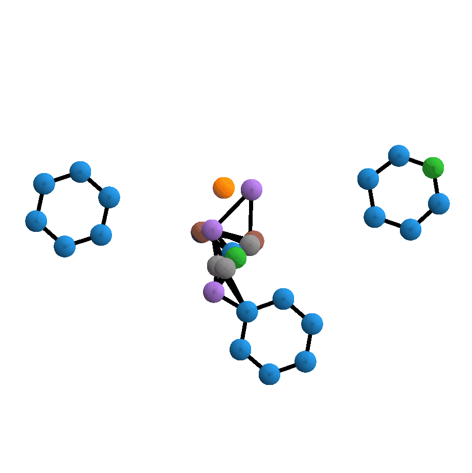

# DiffLinker: Equivariant 3D-Conditional Diffusion Model for Molecular Linker Design


<details>
<summary>Animations</summary>
<br>

<p float="left">
  
  
  
</p>

</details>

## Environment Setup

The code was tested in the following environment:

| Software          | Version   |
|-------------------|-----------|
| Python            | 3.10.5    |
| CUDA              | 10.2.89   |
| PyTorch           | 1.11.0    |
| PyTorch Lightning | 1.6.3     |
| OpenBabel         | 3.0.0     |

You can create a new conda environment using provided `environment.yaml` file:
```shell
conda env create -f environment.yml
```

or manually creating the base environment:
```shell
conda create -c conda-forge -n difflinker rdkit
```

and installing all the necessary packages:
```shell
biopython
imageio
networkx
pytorch
pytorch-lightning
scipy
scikit-learn
tqdm
wandb
```

Activate the environment:
```shell
conda activate difflinker
```

## Models

Please find the models [here](https://doi.org/10.5281/zenodo.7121300) or use direct download links:

| Model                            | Download Link                                                                            |
|----------------------------------|------------------------------------------------------------------------------------------|
| ZINC DiffLinker                  | https://zenodo.org/record/7121300/files/zinc_difflinker.ckpt?download=1                  |
| ZINC DiffLinker (given anchors)  | https://zenodo.org/record/7121300/files/zinc_difflinker_given_anchors.ckpt?download=1    |
| ZINC Size GNN                    | https://zenodo.org/record/7121300/files/zinc_size_gnn.ckpt?download=1                    |
| GEOM DiffLinker                  | https://zenodo.org/record/7121300/files/geom_difflinker.ckpt?download=1                  |
| GEOM DiffLinker (given anchors)  | https://zenodo.org/record/7121300/files/geom_difflinker_given_anchors.ckpt?download=1    |
| GEOM Size GNN                    | https://zenodo.org/record/7121300/files/geom_size_gnn.ckpt?download=1                    |
| GEOM DiffLinker (full pocket)    | https://zenodo.org/record/7121300/files/pockets_difflinker_full.ckpt?download=1          |
| GEOM DiffLinker (backbone atoms) | https://zenodo.org/record/7121300/files/pockets_difflinker_backbone.ckpt?download=1      |
| GEOM DiffLinker (unconditioned)  | https://zenodo.org/record/7121300/files/pockets_difflinker_unconditioned.ckpt?download=1 |


## Usage

In this example, we will consider training and testing process on ZINC dataset. 
All the instructions about downloading or creating datasets from scratch can be found in `./data`. 

### Training DiffLinker

First, download datasets:
```shell
mkdir -p datasets
wget https://zenodo.org/record/7121271/files/zinc_final_train.pt?download=1 -O datasets/zinc_final_train.pt
wget https://zenodo.org/record/7121271/files/zinc_final_val.pt?download=1 -O datasets/zinc_final_val.pt
```

Next, create necessary directories:
```shell
mkdir -p models
mkdir -p logs
```

Run trainig:
```shell
python -W ignore train_difflinker.py --config configs/zinc_difflinker.yml
```

### Training Size GNN

```shell
python -W ignore train_size_gnn.py \
                 --experiment zinc_size_gnn \
                 --data datasets \
                 --train_data_prefix zinc_final_val \
                 --val_data_prefix zinc_final_val \
                 --hidden_nf 256 \
                 --n_layers 5 \
                 --batch_size 256 \
                 --normalization batch_norm \
                 --lr 1e-3 \
                 --task classification \
                 --loss_weights \
                 --device gpu \
                 --checkpoints models \
                 --logs logs
```


### Sampling

First, download test dataset:
```shell
mkdir -p datasets
wget https://zenodo.org/record/7121271/files/zinc_final_test.pt?download=1 -O datasets/zinc_final_test.pt
```

Download the necessary models:
```shell
mkdir -p models
wget https://zenodo.org/record/7121300/files/zinc_difflinker.ckpt?download=1 -O models/zinc_difflinker.ckpt
wget https://zenodo.org/record/7121300/files/zinc_size_gnn.ckpt?download=1 -O models/zinc_size_gnn.ckpt
```

Next, create necessary directories:
```shell
mkdir -p samples
mkdir -p trajectories
```

If you want to sample 250 linkers for each input set of fragments, run the following:
```shell
python -W ignore sample.py \
                 --checkpoint models/zinc_difflinker.ckpt \
                 --linker_size_model models/zinc_size_gnn.ckpt \
                 --samples samples \
                 --data datasets \
                 --prefix zinc_final_test \
                 --n_samples 2 \
                 --device cuda:0
```
You will be able to see `.xyz` files of the generated molecules in the directory `./samples`.

If you want to sample linkers and save trajectories, run the following:
```shell
python -W ignore sample_trajectories.py \
                 --checkpoint models/zinc_difflinker.ckpt \
                 --chains trajectories \
                 --data datasets \
                 --prefix zinc_final_test \
                 --keep_frames 10 \
                 --device cuda:0
```
You will be able to see trajectories as `.xyz`, `.png` and `.gif` files in the directory `./trajectories`. 

### Evaluation

First, you need to download ground-truth SMILES and SDF files of molecules, 
fragments and linkers from the relevant test sets (recomputed with OpenBabel) + SMILES of the training linkers.
Check [this resource](https://doi.org/10.5281/zenodo.7121448) for finding the right ones.
Here, we will download files for ZINC:
```shell
mkdir -p datasets
wget https://zenodo.org/record/7121448/files/zinc_final_test_smiles.smi?download=1 -O datasets/zinc_final_test_smiles.smi
wget https://zenodo.org/record/7121448/files/zinc_final_test_molecules.sdf?download=1 -O datasets/zinc_final_test_molecules.sdf
wget https://zenodo.org/record/7121448/files/zinc_final_train_linkers.smi?download=1 -O datasets/zinc_final_train_linkers.smi 
```

Next, you need to run OpenBabel to reformat the data:
```shell
mkdir -p formatted
python -W ignore reformat_data_obabel.py \
                 --samples samples \
                 --dataset zinc_final_test \
                 --true_smiles_path datasets/zinc_final_test_smiles.smi \
                 --checkpoint zinc_difflinker \
                 --formatted formatted \
                 --linker_size_model_name zinc_size_gnn
```

Then you can run evaluation scripts:
```shell
python -W ignore compute_metrics.py \
                 ZINC \
                 formatted/zinc_difflinker/sampled_size/zinc_size_gnn/zinc_final_test.smi \
                 datasets/zinc_final_train_linkers.smi \
                 5 1 None \
                 resources/wehi_pains.csv \
                 diffusion
```
All the metrics will be saved in the directory `./formatted`.